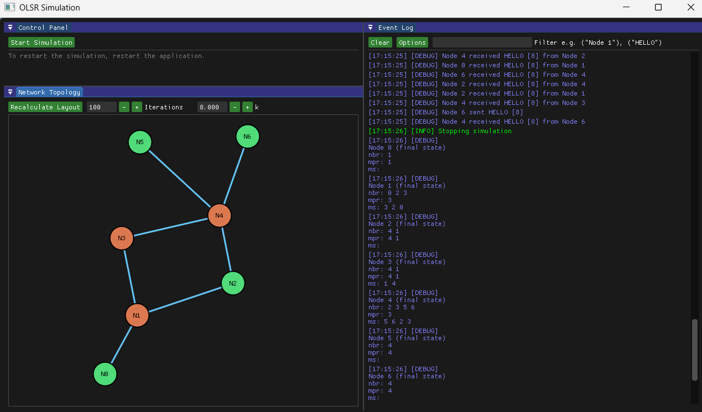

# OLSR Simulation



This repository contains a simulation of the Optimized Link State Routing (OLSR) protocol using C++ and a custom simulation framework. The simulation models a network of nodes in an ad-hoc wireless environment, demonstrating the OLSR protocol's functionality.
<br/>
To run the simulation, first ensure you have CMake and MSVC installed. Then, follow these steps:

```bash
git submodule update --init --recursive
mkdir build && cd build
cmake .. -G "Visual Studio 17 2022" -A x64
cmake --build .
./Debug/olsr-sim.exe
```

## Input File Format

Input network details as a txt file which can be chosen from the GUI. The format of the file is as follows:

```
# Number of nodes
# Adjacency matrix (0 for no link, 1 for link)
```

example:

```
4
1 1 1 0
1 1 0 1
1 0 1 1
0 1 1 1
```

## Simulation Details

`Environment` class manages the simulation environment, including node creation, movement, and communication. The `Node` class represents individual nodes in the network, handling message passing and routing logic.
<br/>
The nodes are spun up in different threads to simulate concurrent operations. The simulation runs for a predefined duration, during which nodes exchange messages and update their routing tables.
